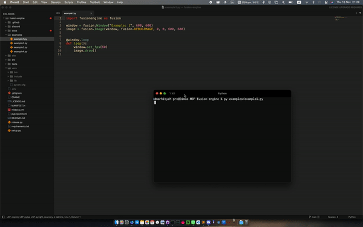

---
hide:
  - navigation
---


# Basic rendering tutorial

## Introduction
This is a tutorial so you would understand the basics of the engine and how it works. In this tutorial we will learn how to render a window and draw some images on it. If you want to learn more, then go to [our docs](https://docs.fusion-engine.tech) and select wiki.

This tutorial also expect you to have everything setup, if not, head over to [tutorial 1: setting everything up](setup.md)

The Final Product Should Look like This:


## Creating a window

So if you read tutorial 1 you know we have the main variable running our engine object. So now we create a window with the help of that main object:
```python
window = main.window.new_window("Tutorial 2", 600, 600)
```
The first argument that we give our function is our title, second argument is our width and third one is height

## Pre-loading image
We will now pre-load a image so we can draw it later on our window. We do it like this:
```python
image = main.image.open_image(window, main.debug.DEBUGIMAGE, 0, 0, 600, 600)
```
Fist argument is our window, second is our image path, third is our x position, fourth is our y position, fifth is our width and sixth is our height. As you maybe see were using main.debug.DEBUGIMAGE, which is a build in image into our engine for testing purposes. We will use it for our tutorial

## Starting a loop
A loop is basicly what lets our window be open the whole time and not be automaticly closed. You also run there functions that need to ran every frame. So we start a loop like this:
```python
@main.window.loop
def loop():
	... # Code goes here

```

## Drawing image
So we still need to draw our image after loading it, and you can do that easily inside a loop like this:
```python
@main.window.loop
def loop():
    main.image.draw_image(image)

```
As you see we have a draw_image function in our loop with the image loaded image as argument.

## Full code
Here is our full code that we could through this tutorial:
```python
import fusionengine as fusion

main = fusion.Main()

window = main.window.new_window("Example: 1", 600, 600)
image = main.image.open_image(window, main.debug.DEBUGIMAGE, 0, 0, 600, 600)


@main.window.loop
def loop():
    main.image.draw_image(image)
```

## Ending
This was our basic tutorial to images. There are (or will be) more tutorials, so check them our. Or otherwise you could check our [docs](<https://docs.fusion-engine.tech>) for more information. Happy coding!

